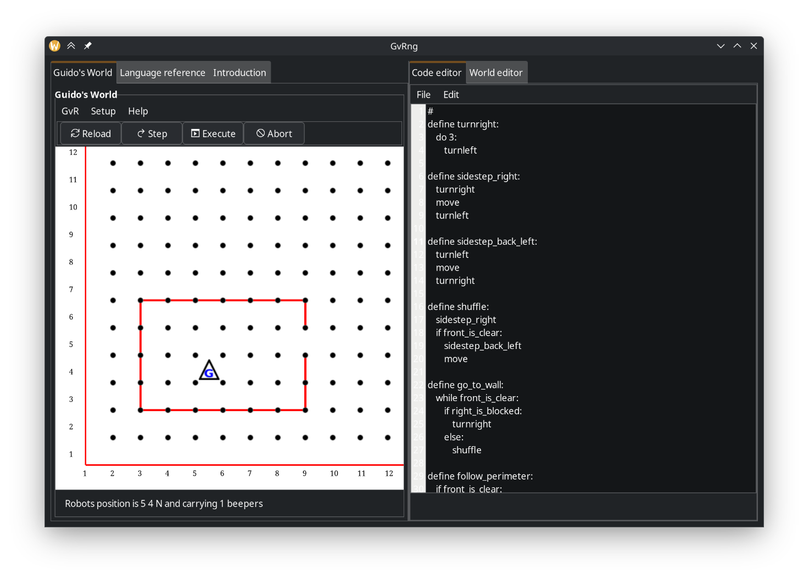

<h2 align="center">GvRng Python 3 Port</h2>



This repo is an attempt to port [GvRng](https://gvr.sourceforge.net/download)
version 4.4, a free and open-source simplistic programming language
developed by [Jeffery Elkner](http://www.elkner.net/) designed to introduce
beginners to the fundamentals of programming.

GvRng is short for "GvR Next Generation", GvR being "Guido van Robot".

### Motivation

This silly porting project started because I was struggling to run GvRng as
instructed in my university's curriculum. Realizing it has not been updated for
15 years (last update was 2010, according to its
[official site](https://gvr.sourceforge.net)) yet still uses python2 and the
old deprecated pygtk library, I decided to port this both for fun and I guess
as python refresher.

### Running

This project is a GTK application written in Python. Before running, you'll
need to install some system dependencies and set up a Python environment.

**Disclaimer:** This has only been tested on Linux (Fedora/-based and
Ubuntu/Debian-based systems). It has not been tested on Windows or macOS,
so your mileage may vary.

#### 1. System Dependencies

You need to install GTK3, its Python bindings (PyGObject), and GtkSourceView.

**On Fedora/-based:**

```bash
sudo dnf install gtk3-devel gobject-introspection-devel gtksourceview4-devel
```

**On Debian/Ubuntu:**

```bash
sudo apt-get install libgtk-3-dev libgirepository1.0-dev libgtksourceview-4-dev
```

#### 2. Python Environment

This project uses `uv` for package management.

1.  Install `uv` if you don't have it already:
    ```bash
    pip install uv
    ```
    (Or follow the official installation instructions at [astral.sh/uv](https://astral.sh/uv))

2.  Create a virtual environment and let uv sync the dependencies:
    ```bash
    uv venv
    source .venv/bin/activate
    uv sync
    ```

#### 3. Running the application

Once the dependencies are installed and the virtual environment is activated,
you can run the application with:

```bash
python3 main.py
```

### License

GvRng is originally licensed with GPLv2 as seen in the [copyright file](./copyright)

### Acknowledgements

Thanks to the original contributors of GvRng (Guido van Robot Next Generation)
that made this app possible: Waseem Daher, Donald Oellerich, Paul Carduner,
Lex Berezhny, Michele Moore, Steve Howell, Staz Zytkiewicz, and Jeff Elkner.

Sourced from https://gvr.sourceforge.net/botlot

### Notes

1.  Most of the functionalities work, but no comprehensive tests yet.
2.  I got rid most of the i18n code (calls to `_("...")`) to make the port
    simpler. The app runs fine without it (english-only), and I don't have any
    plans to fix it yet.
3.  This port is pretty dirty right now, I prioritized getting it running first
    before any cleanups.
4.  I omitted the `docs/` folder from this repository. It contained a lot of
    assets that might be too big to fit in a git repository.
